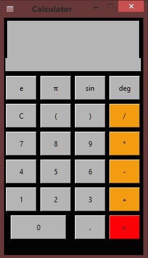

<h1 align="center">Python Projects Practice</h1>

1. [Rock, paper, scissors Game](#rpsg)
2. [Currency Converter](#cconverter)
3. [Calculator](#calculator)

------

## 1. :video_game: <a id="rpsg"/>Rock, paper, scissors Game

Recreation of Rock, paper, scissors game in Python with tkinter and random module

 [README.md](./Rock-paper-scissors-Tkinter-Practice) 

------

## 2. :currency_exchange: <a id="cconverter"/>​Currency Converter

- Currency converter online whit api (*exchangerate*) 
- [README.md](./currency-converter) 

 

------
## 3. :pencil: <a id="calculator"/>​Calculator
- [file](./calculator) 

