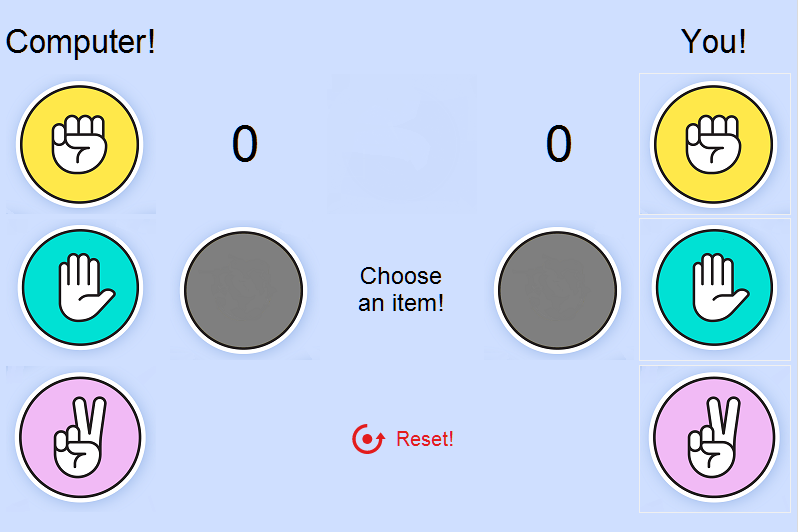
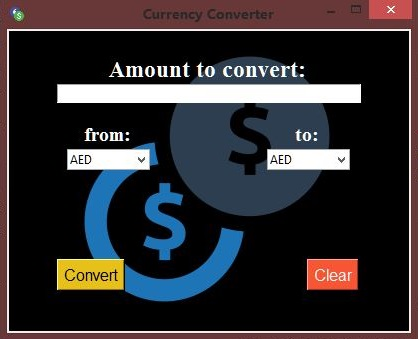
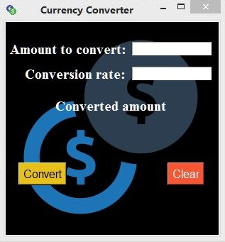

# Python Projects Practice

------

### 1. :video_game: Rock, paper, scissors Game

Recreation of Rock, paper, scissors game in Python with tkinter and random module

 [README.md](Rock-paper-scissors-Tkinter-Practice\README.md) 

------

### 2. :currency_exchange: ​Currency Converter

- Currency converter online whit api (*exchangerate*) 
- [README.md](currency-converter\README.md) 

 

------

