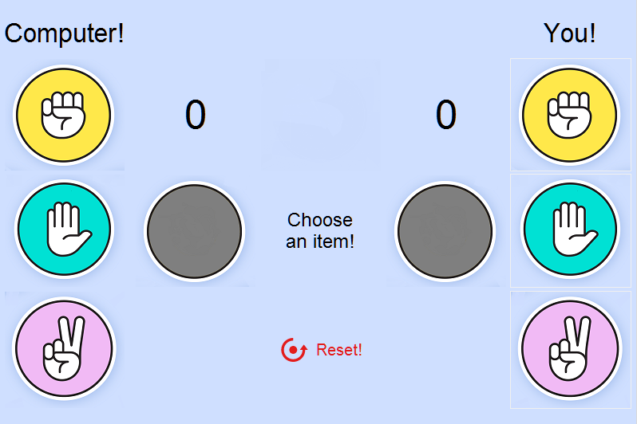

<h1 align="center">:video_game: Rock, paper, scissors Game</h1>
Recreation of Rock, paper, scissors game in Python with tkinter and random module

### :computer: Requeriments
- Python 3x

### :speaker: Launch game
1. Download python and install it: <a href="https://www.python.org/downloads/">Link</a>
2. Clone or download this project  
3. Open in explorer the project folder  
4. Open `main.pyw`

### :camera: Screenshot
 

