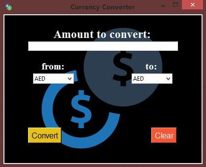

# :currency_exchange: Currency Converter

- Project #2 Currency Converter online whit api (exchangerate)  
  - API: https://exchangerate.host/

###  Requeriments

- Python 3x
- requests

###  Launch File

1. Download python and install it: [Link](https://www.python.org/downloads/)
2. Clone or download this project
3. install `pip install -r requirements.txt `
4. Open in explorer the project folder
5. Open `currency_converter.pyw` or `converter.pyw`

###  Screenshot

